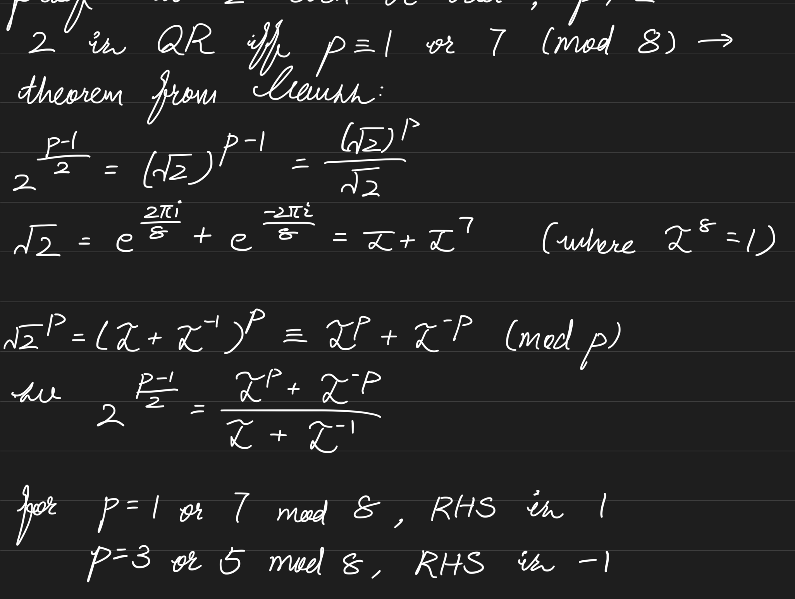

**table of content**

- [Breaking DDH assumption](#decisional-diffie-hellman-assumption)
- [Euler's criterion](#eulers-criterion)

# Decisional Diffie-Hellman Assumption
TODO: this is actually wrong; if $g$ is already a QR then $h$ is always a QR

The Decisional Diffie-Hellman Assumption (DDH assumption) is the basis on which we can argue for IND-CPA of ElGamal's crypto system. However, the vanilla DDH asumption cannot hold for arbitrary $g$.
    
Recall the DDH assumption game:

1. Challenger generates the parameters $g, p \in \mathbb{Z}$, randomly sample positive integers $x, y, z \leftarrow \mathbb{Z}^+$ and randomly sample a bit $b \in \{0, 1\}$
1. Challenger computes $g^x, g^y$ and $h$, where $h = g^{xy}$ when $b = 0$ and $h = g^z$ when $b = 1$
1. Adversary receives $g^x, g^y, h, g, p$ and computes $b^\prime$

The adversary wins if $b^\prime = b$. In other words, the adversary wins if it can distinguish $g^{xy}$ from $g^z$.

Observe that for random element $x \in \mathbb{Z}_p^*$, $x^\frac{p-1}{2} \equiv \pm 1 \mod p$. The right hand side is 1 if and only if $x$ is a quadratic residue or $-1$ otherwise. So we can build an adversary that computes $h^\frac{p-1}{2} \mod p$ and returns $b^\prime = 0$ if $h^\frac{p-1}{2} \mod p$ evaluates to $1$. This adversary will have non-negligible advantage because $g^{xy}$ has 3/4 probability of being a QR while $g^z$ only has 1/2 probability. We can compute that this adversary has 1/8 advantage.

# Euler's criterion
Let $p$ be an odd prime number, then we know the multiplicative group $\mathbb{Z}_p^*$ has primitive root $g \in \mathbb{Z}_p^*$ such that:

$$
\mathbb{Z}_p^* = \{g^x \vert x \in \mathbb{Z} \}
$$

**Euler's criterion** can be used to efficiently compute whether some element $a \in \mathbb{Z}_p^*$ is a quadratic residue or now:

$$
a^\frac{p-1}{2} \equiv \begin{cases}
1 \;\;\;\;\; (\text{a is QR}) \\
-1 \;\;\;\;\; (\text{otherwise})
\end{cases}
$$

The positive case is easy to prove knowing that if $a$ is a quadratic residue, then $a$ is an even power of $g$. **what about the negative case???**

Two notable results extend from Euler's criterion:

1. $-1$ is quadratic residue iff $p \equiv 1 \mod 4$
2. $2$ is quadratic residue iff $p \equiv 1, 7 \mod 8$

The first result is easy to using Euler's criterion to compute $(-1)^\frac{p-1}{2}$, which is $1$ if $p \equiv 1 \mod 4$ and $-1$ if $p \equiv 3 \mod 4$. The second result is due to to Gauss **need to review this**:

